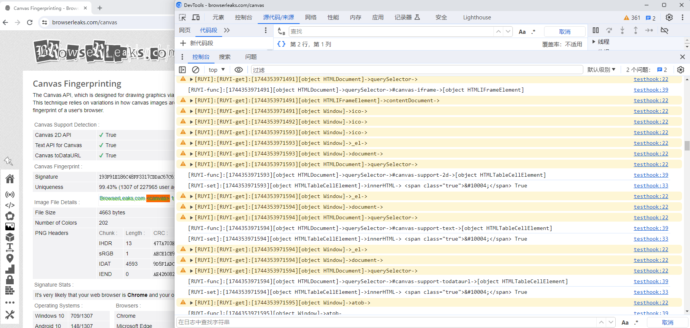

# 简介
该工具用于进行网页前端JavaScript流程分析。

使用说明位于[Bilibili 如意IT](https://www.bilibili.com/video/BV1MrdGYfEwC/?spm_id_from=333.1387.homepage.video_card.click)
## 浏览器环境信息打印展示


使用说明：

1. 下载mini_installer后进行安装，桌面会出现Chromium浏览器图标。
2. 在网页开始位置断点，断点后运行下面的脚本，可以自由定制其中的打印函数和过滤内容。
```JavaScript
let ruyirun=function (){
Object.defineProperty(Ruyiniubi.prototype, "ruyihook", { value: true });
let ruyiniubi=new Ruyiniubi;
let others = [
"Uint8Array","ArrayBuffer","Reflect","JSON","Proxy","isNaN","Promise",
"RegExp","Set","WeakMap","Performance","parseInt",
"Map", "BigInt", "DataView", "Boolean", "Mojo", "Array", "String", "Object", "Date","Symbol", "Number",
"Function", "Math", "dir", "dirxml", "profile", "profileEnd", "table",
"keys", "values", "undebug", "debug", "monitor", "unmonitor", "inspect",
"copy", "queryObjects", "$-", "$0", "$1", "$2", "$3", "$4", "$$", "$_", "$x",
"$", "getEventListeners", "getAccessibleName", "getAccessibleRole",
"monitorEvents", "unmonitorEvents", "clear"
];
ruyigetjs = function(target, prop) {
    // 如果prop在排除名单中，则不执行打印
    if (others.includes(prop)) {
        return;
    }
    let now = Date.now();
    // 将属性名转换成字符串以避免Symbol错误
    let propName = (typeof prop === "symbol") ? prop.toString() : prop;
    ruyiniubi.print("[RUYI-get]:" + "[" + now + "]" + target + "->" + propName + "->", target[prop]);
};

ruyisetjs = function(target, prop, value) {

    // 如果prop在排除名单中，则不执行打印
    if (others.includes(prop)) {
        return;
    }
    let now = Date.now();
    let propName = (typeof prop === "symbol") ? prop.toString() : prop;
    console.log("[RUYI-set]:" + "[" + now + "]" + target + "->" + propName + "->", value);
};

funcjs = function(target, funcname,args, value,exception) {
    let now = Date.now();
    if(!exception){
        console.log("[RUYI-func]:" + "[" + now + "]" + target + "->" + funcname + "->"+args+ "->"+value);
    }else{
        console.log("[RUYI-func-exception]:" + "[" + now + "]" + target + "->" + funcname + "->"+args+ "->"+value);
    }

};
    
hooklog = true;
}

ruyirun();
```
3. 浏览器控制台中就有日志信息了。要终止只需
```JavaScript
hooklog = false;
或者
Object.defineProperty(Ruyiniubi.prototype, "ruyihook", { value: false });
```

# 免责声明
本免责声明旨在明确指出，本项目为课程教学产品，不得将本项目技术用于任何非法目的或破坏行为。作者对于任何使用本项目对他人或系统造成的损害概不负责。

# 浏览器课程培训，卖技术混口饭吃。
- b站[如意教育](https://space.bilibili.com/172381477)。
- vx: `Charleval`
- 课程《从零开发Chromium指纹浏览器》<td>😄</td>：教学员从零开发一个指纹浏览器
- 课程《Chromium指纹浏览器过检测专题》<td>😄</td>：专门用于分析各个浏览器指纹检测网站，从源码上完美过检测。
- 课程《V8定制Hook浏览器环境执行信息》<td>😄</td>：专门用于分析网站指纹信息，帮助修改指纹。
- 如意教育，提供专业指纹浏览器开发教学服务，一对一答疑。
